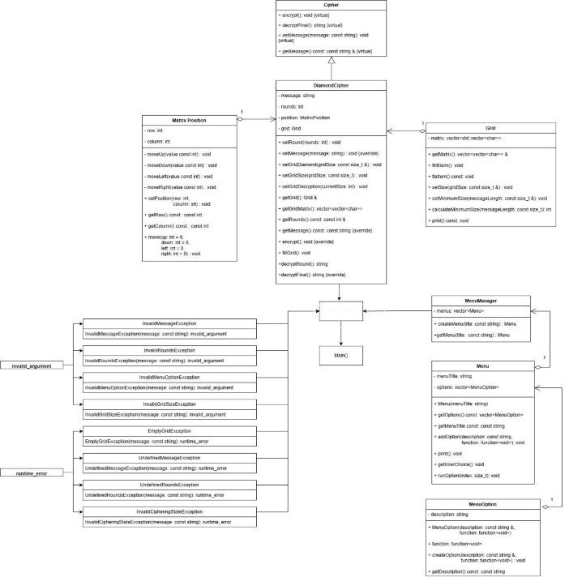

# Diamond Grid Encryption System

My Diamond Grid Encryption System is a modern C++ console application that encrypts and decrypts messages using a custom diamond-shaped grid algorithm. It was developed as part of the *Object Oriented Programming* course at Griffith University.

## How It Works

1. **Encryption:**
   - The user enters a message which is cleaned and a period is appended to the end
   - A grid, that will fit the message, is initialised using a vector of vectors
   - The message is inserted into the grid in a diamond pattern, starting from the middle leftmost square and going upwards diagonally
   - Once the entire message has been inserted, the remaining blank squares are filled with junk
   - The grid is then flattened into a string by reading the grid from left to right, top to bottom
   - The flattened grid is the encrypted message, this can be done n times to futhur encrpyt the message

1. **Decryption:**
   - The input is checked if it is a valid encrypted message
   - A grid that fits the message is constructed
   - The grid is read until it reaches the middle of the grid
   - The read string is either a round in multiround encryption or the decrypted message

## Features

- **Diamond-Shaped Grid Encryption**  
  Encrypts text by placing characters in a diamond pattern inside a square grid. Remaining cells are filled with random uppercase letters for masking.

- **Multi-Round Encryption & Decryption**  
  Supports repeated rounds of encryption. The same number of rounds must be used to correctly decrypt the message.

- **Random Character Masking**  
  Filler characters make the ciphertext look random, obscuring the original message and its length.

- **Automatic or Manual Grid Sizing**  
  Grid size is always square and odd (e.g., 5x5, 7x7). The program can calculate the smallest valid grid or accept a custom one.

- **Text-Based User Interface**  
  Continuous menu-driven console interface for ease of use. Supports error handling and re-prompts on invalid input.

- **Object-Oriented Design**  
  Modular structure using modern C++ principles:  
  - `Encryptor`: Core algorithm  
  - `Grid`: Manages the square grid  
  - `UI`: Handles user interaction  
  - `main.cpp`: Entry point and menu loop

## Demonstration

## Program Structure

## Disclaimer

This system was developed for educational purposes only and is not suitable for real-world encryption. It was created to demonstrate programming concepts and design patterns.
